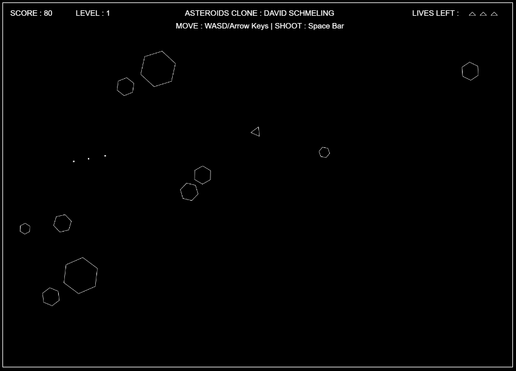
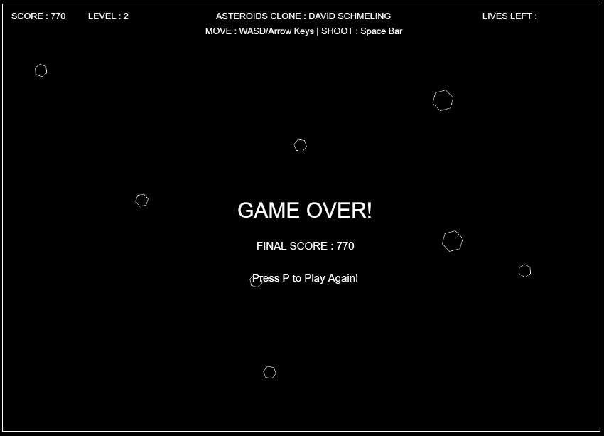

# AsteroidsClone
<b>This is a clone of the game Asteroids written in JavaScript to be used in a web browser.</b>  
I have made this program to become more familiar with JavaScript and its abilities.
The bulk of the game is written in JavaScript linked with the HTML file and CSS file. 
## How to Play 
-The game starts when the webpage has loaded    
-The Arrow Keys or WASD are used to move the spaceship around the screen  
-The Space button is used to shoot at the asteroids  
-If all the asteroids are destroyed, the game moves up a level  
-Each level adds two more starting asteroids to the game  
## Screenshot of Game
  
-The current score and level is displayed in the top left  
-The current amount of lives is displayed in the top right  
-The three triangles each represent a life and are removed when a life is lost  
-Each asteroid/piece destroyed adds 10 points to the total score    
-The first level starts with 6 asteroids, which break into smaller pieces  
-Each level increases the amount of starting asteroids by 2
## Screenshot of End Screen
  
-When all lives are lost, the program outputs a game over message  
-The final score is displayed and an option to start a new game is displayed    
-The user must press P to start a new game and this resets the game
